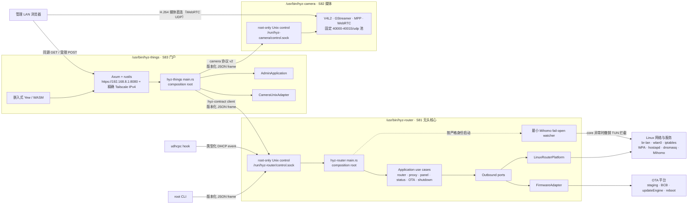
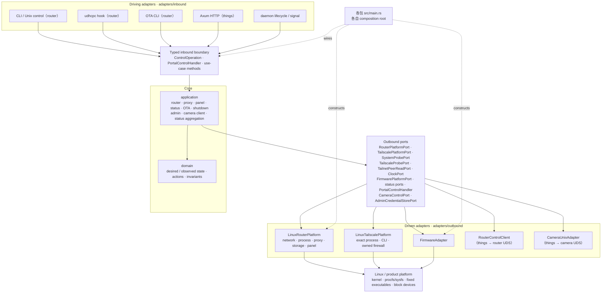
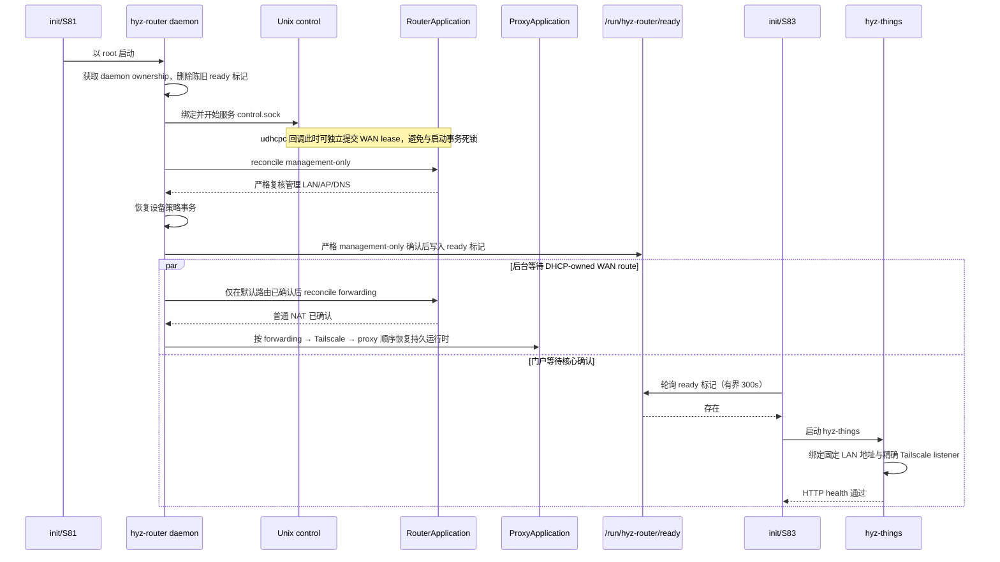

# hyz-things 三进程架构

## 目标与当前状态

路由控制面收敛为独立无头核心 `hyz-router`，管理门户为独立进程 `hyz-things`，媒体面为独立进程 `hyz-camera`。三者各自是独立的 Cargo 包、独立的板端 ELF、独立的 composition root，通过 root-only 版本化 Unix socket 契约协作：

```text
apps/rust/contract  -> 共享 wire 契约（纯 serde，无框架依赖）
apps/rust/router    -> /usr/bin/hyz-router（无头路由核心，S81）
apps/rust/things    -> /usr/bin/hyz-things（门户/管理进程，S83）
apps/rust/camera    -> /usr/bin/hyz-camera（媒体进程，S82）
```

- `hyz-router` 是**稳定的长运行服务**：拥有管理 LAN、WAN DHCP、IPv4 转发/NAT、Mihomo 代理、Tailscale 生命周期、OTA 与 shutdown；**没有** HTTP、Web、管理员认证或摄像头信令。它只服务 root-only `/run/hyz-router/control.sock`，并在严格 management-only reconcile 后才写入 `/run/hyz-router/ready` 标记。
- `hyz-things` 以「hyz things」个人网站形式承载管理面：LAN `192.168.8.1:8080`（HTTPS，自签证书）与精确 Tailscale IPv4 监听、管理员认证（Argon2id 凭据仍在 `/userdata/hyz-router/admin/credential.json`）、会话/CSRF、嵌入式 Yew SPA、camera 客户端与 Tailscale listener 管理。它等待 router ready 标记后才绑定 HTTPS，通过 `hyz-contract` client 驱动 router，通过 `/run/hyz-camera/control.sock` 驱动 camera。
- `hyz-camera` 是独立媒体进程，接受受限状态、会话、旋转请求，媒体在浏览器与固定 `40000-40015/udp` 池之间直连；它不执行网络或防火墙命令。

推送演进：`apps/rust/things/tools/deploy-app.sh` 只支持对 `hyz-things` 和 `hyz-camera` 热推送新 ELF。推送 camera/things 只停止并重启对应 init 服务，**router 永不因此重启**；`hyz-router` 的修改必须通过 OTA 发布。停止任何服务之前，工具按注册表记录的协议版本做兼容性检查（见「热推送与协议兼容窗口」）。

旧的统一单 ELF 方案（Web/Axum/管理员认证内嵌于 `hyz-router`）已完成拆分；本文档 2026-08-16 之前的 OTA 验收记录均属于拆分前的统一 ELF，作为历史验收保留。`apps/router-panel/{shared,server,adapter-linux,frontend}` 多 crate 方案此前已被否决并从源码删除；独立 MetaCubeXD 静态包也已删除，产品只保留 hyz-things 这一套管理 Web UI。

**源码、rootfs 与 recovery-free OTA 已完成三进程 cutover：** 无头 router 通过 `/run/hyz-router/ready` 标记门控门户，`S83hyz-things` 等待标记后才启动门户并自检 HTTP；`make apps` 构建三个 ELF，`make overlay` 安装三者与产品元数据。`make check` 覆盖 contract、things、router 三 crate 的 fmt/test/clippy 与部署工具 host 测试。摄像头采集固定使用 RKISP 原生 `3840×2160` 全幅 NV12，输出分辨率与码率由固定枚举的 16:9 预设选择（默认 `720p · 2.5 Mbps`，可选 `1080p · 5 Mbps`、`1440p · 10 Mbps`、`4K · 20 Mbps`，均 `@ 30 FPS`、H.264 Baseline），非 4K 预设由 `videoscale` 缩放，画面旋转由 `videoflip` 在编码前应用（0/90/180/270°，浏览器不做 CSS 旋转），时间戳水印由 `clockoverlay` 在旋转后烧入（左上角、黑底、固定 20px 字号）。真实摄像头自动验收见 [`camera-hardware-e2e.md`](camera-hardware-e2e.md)。

## 摄像头媒体管线

camera 的媒体面由固定 GStreamer 管线驱动（`src/adapters/outbound/gstreamer.rs`），视频管线与音频管线各自独立、都以引用计数方式随第一个 viewer 会话启动、最后一个会话退出停止。浏览器与板端之间不经过任何服务端媒体中转：RTP 由每个 str0m 会话线程从 `FrameHub` 队列取编码帧直发浏览器的固定 `40000-40015/udp` 端口池。

### 视频采集管线

```text
v4l2src（RKISP 3840×2160 全幅 NV12，full-range BT.709，固定 30fps）
→ capsfilter（NV12 3840×2160 @ 预设帧率）
→ queue（max-size-buffers=2，leaky=downstream 丢旧帧）
→ [videoscale + capsfilter（仅非 4K 预设缩放到目标 16:9）]
→ videoflip（按 0/90/180/270° 逆时针，编码前应用，浏览器不做 CSS 旋转）
→ clockoverlay（时间戳水印：`%Y-%m-%d %H:%M:%S`，DejaVu Sans 20px，左上角黑底）
→ mpph264enc（Baseline；level 按帧大小 720p/1080p=4、1440p/4K=5.1；gop=帧率；bps=预设码率）
→ h264parse（config-interval=-1 周期重发 SPS/PPS）
→ capsfilter（byte-stream / alignment=au）
→ appsink → FrameHub 扇出
```

水印时间走 glibc `localtime`：`hyz-camera` 启动时设 `TZ=CST-8`（上海 UTC+8、无夏令时；板端 rootfs 无 tzdata，`Asia/Shanghai` 会解析失败回退 UTC，因此用等价的 POSIX 偏移串）。采集固定 RKISP 全幅再按预设缩放，非 4K 预设由 `videoscale` 完成；`mpph264enc` 输出经 `FrameHub` 零拷贝扇出给各 viewer 的独立帧队列。

### 音频采集链（对讲麦克风）

```text
alsasrc（hw:0，板载麦克风在 L 声道）
→ audioconvert → audioresample
→ capsfilter（S16LE 48kHz mono，channel-mask=FL）
→ audioconvert → audiocheblimit 高通 150Hz（4 阶）→ audiocheblimit 低通 8kHz（4 阶）→ audioconvert
→ webrtcdsp（AEC、HPF、NS high，关闭内部 AGC、limiter）
→ RNNoise + VAD 探针（nnnoiseless，480 样本帧，首帧写静音，语音概率双阈值，100ms attack / 400ms release，静音时后置 -12dB、人声时后置 +6dB 增益/限幅，非整帧透传）
→ opusenc（32kbps、20ms、DTX、audio-type=voice）
→ appsink → 各会话 str0m 音频发送
```

- `channel-mask=FL` 避免默认 (L+R)/2 混音把单麦衰减约 10dB 并混入空接的 R 声道。
- 150Hz 高通优先处理板端“呼呼声”和低频模拟扰动，8kHz 低通限制 ADC/电源宽带噪声；两者依赖 `audiocheblimit`，插件缺失时退化为不过滤。
- `webrtcdsp` 保留 AEC、HPF 和 NS high 作为互补抑噪，但关闭内部 AGC；RNNoise 的 `process_frame` 返回语音概率，探针使用 0.65/0.35 双阈值控制语音状态，在 100ms 内从静音 `-12dB` 平滑增加到人声 `+6dB`、在 400ms 内释放回 `-12dB`，避免说话触发时把残余噪声一起抬高。
- RNNoise 是采集链的最终神经网络降噪器。它使用 48kHz 的 480 样本帧；首帧丢弃以避开初始化淡入伪影。
- DTX 让静音段每 400ms 才发一帧；`audio-type=voice` 走 SILK 语音编码。

### 回放尾链（对讲喇叭）

```text
audiomixer（会话按需 request pad）→ capsfilter（S16LE 48k mono）
→ webrtcechoprobe（AEC 参考，固定元素名 webrtcechoprobe0）
→ audioconvert → audioresample → alsasink（async=false，sync=false）
```

`sync=false` 是因为管线时钟是 alsasrc 提供的从时钟（阶梯式跳变），`sync=true` 时回放会变成短突发；配合 mixer 前的 queue 吸收网络抖动实测为连续纯净播放。

## 架构图

### 运行时与外部边界



浏览器控制在 `hyz-things` 进程内经过同一个 `PortalControlHandler`，不连接 root-only router socket；CLI 和 udhcpc hook 只作为该 socket 的客户端存在。`hyz-things` 是 router/camera 的普通客户端，**不是**它们的 composition root——每个进程的完整生产 adapter 只由各自的 `main.rs` 构造。

摄像头直播使用受限边界：观看对匿名开放——浏览器从 things 领取 15 分钟短时 viewer 令牌（内存驻留、最多 128 个），令牌只允许创建/关闭自己名下的会话；画面分辨率与旋转设置仍要求管理员 session。things 通过固定 `/run/hyz-camera/control.sock` 调用独立 `hyz-camera`，并从当前 LAN 或 exact Tailscale listener 派生 candidate 地址。协商完成后，H.264 媒体直接在浏览器与 `hyz-camera` 的固定 `40000-40015/udp` 池之间流动，不经过 Axum 或 router。router 仍是唯一 firewall authority，camera 不执行网络命令。

### 每包六边形架构

三个进程各自在包内采用六边形架构，共享 `hyz-contract` 定义的类型化 wire 边界：

```text
hyz-contract  src/                  纯 serde 值对象与校验/脱敏不变量（可选 client 传输）
hyz-router    src/domain/           纯状态、值对象与不变量
              src/application/      用例与 outbound ports
              src/adapters/inbound/ CLI、Unix control、udhcpc hook、OTA CLI
              src/adapters/outbound/ network、proxy、process、storage、firmware、system、tailscale
              src/main.rs           唯一 production composition root
hyz-things    src/domain/           纯状态（re-export 自 hyz-contract）
              src/application/      admin、camera client、status 聚合、PortalControlHandler
              src/adapters/inbound/ Axum HTTP（LAN + Tailscale exact listeners）
              src/adapters/outbound/ router UDS client、camera UDS client、admin storage、tailscale listener
              src/web/              Yew/WASM 前端（web feature，只依赖 domain）
              src/main.rs           唯一 production composition root
hyz-camera    src/domain/           会话、preset、watermark、rotation 模型
              src/application/      lifecycle、ports（FrameHub 扇出）
              src/adapters/inbound/ root-only Unix control
              src/adapters/outbound/ gstreamer、webrtc
              src/main.rs           唯一 production composition root
```



实线表示运行时调用方向：外部请求从 driving adapter 进入类型化边界，核心用例通过 outbound port 请求平台能力，核心本身不反向依赖 adapter。虚线只表示 `main.rs` 在启动时完成装配，不是业务调用。跨进程的驱动/被驱动关系全部落在 `hyz-contract` 的版本化 frame 上：things 是 router 与 camera 的类型化客户端，不是它们的组合根。Yew 只在浏览器中通过 HTTP 使用 native 服务，不与 things 的 `adapters/inbound` 建立 Rust 编译依赖（`web` feature 只编译 `domain` 与 SPA）。

### Daemon 启动与就绪边界



control socket 可服务不等于 router 已就绪，router ready 标记也不等于门户已就绪。ready 标记是核心对管理面严格 reconcile 的最终确认，只有它出现后 `S83hyz-things` 才会启动门户并绑定 LAN HTTP；即使 WAN/DHCP 不可用，核心的管理 LAN/AP/DNS 也保持可用。后台恢复任务每次先确认 DHCP-owned 默认路由，再在同一 `router_proxy` 串行区内按 forwarding、Tailscale、proxy 顺序恢复；`unknown`、外部所有权或复核失败都不会被提升为 ready。push camera/things 时 router 进程与 ready 标记都不受影响；push router 后门户保持运行并自动重连 UDS。

WAN DHCP 租约按地址、metric `600` 路由、resolver 条目和 ownership record 整体提交；任一步失败都按精确动作逆序回滚。Buildroot 的 `/etc/resolv.conf -> ../tmp/resolv.conf` 在冷启动时允许目标尚不存在：adapter 只解析并校验固定 allowlist 中的目标父目录，再原子创建 `/tmp/resolv.conf`，不能因 dangling symlink 撤销已收到的有效租约。

## Composition roots

每个进程的 `src/main.rs` 是各自唯一的装配点：

- `hyz-router` 构造：`LinuxRouterPlatform`（typed `ip`/legacy `iptables`、管理网络进程身份、网络和 Mihomo 状态）、`LinuxTailscalePlatform`（固定 `/usr/bin/tailscaled` 与 `/usr/bin/tailscale`、PID/start/exe/argv/socket/interface 身份、持久 mode/state 以及 Tailscale owned firewall）、`LinuxMihomoFailOpenPlatform`（同一 ELF 的隐藏 watcher 角色，仅负责 PID/start 绑定的 TUN fail-open）、`FirmwareAdapter`（OTA 下载、RKFW/SHA-256、BCB、`updateEngine`、reboot）、`ReadStatus`（router/proxy/tailscale/system 的部分成功聚合）与 root-only local control；就绪后写入 `/run/hyz-router/ready`。
- `hyz-things` 构造：`AdminFileAdapter`/`AdminApplication`（Argon2id 凭据，`/userdata/hyz-router/admin/credential.json`）、`CameraApplication(CameraUnixAdapter)`、`RouterControlClient`（`hyz-contract` client）、`PortalStatus`（router 不可用时返回明确 degraded 快照）、CSRF token、`PortalTls`（首次启动自签证书，`/userdata/hyz-things/tls/`）、LAN 固定 `192.168.8.1:8080` HTTPS 监听与 Tailscale exact listener 管理循环。
- `hyz-camera` 构造：pipeline/session 生命周期、`FrameHub` 扇出、str0m 会话线程与固定 UDP 端口池，root-only control socket。

`hyz-router` 的命令行：

```text
hyz-router daemon
hyz-router status [--json]
hyz-router router enable|disable
hyz-router proxy lan-tun enable|disable
hyz-router proxy tailscale enable|disable
hyz-router wifi status|scan
hyz-router wifi ap apply|confirm|cancel
hyz-router subscription get [--json]
hyz-router subscription refresh
hyz-router ota verify|download|install|install-recovery|apply ...
```

`daemon` 是正常控制路径中唯一构造完整生产 adapter 的角色。普通 CLI、同一 ELF 的 udhcpc hook 和 `hyz-things` 都是 `/run/hyz-router/control.sock` 客户端；socket 位于 root-only `0700` 目录，文件模式 `0600`，并用 Linux peer credentials 再次要求 UID 0。Mihomo watcher 是唯一的最小特权例外：它由同一 composition root 装配，只能按已记录的 core PID/start/exe/argv 身份执行 fail-open，不提供公开 CLI、HTTP 或 control operation。

OTA 和 router enable/disable 仍不通过 LAN API 暴露。匿名 LAN 页面只保留状态展示、LCD 控制和受限测速；LAN TUN、Tailscale 中继代理与已验证组内节点选择现与 AP/STA、设备别名/策略及订阅来源一起，只通过固定 typed API 暴露给已完成强制改密的管理员 session。浏览器不能提交命令、路径、原始 wpa_supplicant/hostapd/Mihomo 配置、provider 名、测试 URL 或 timeout。凭据和订阅 URL 不回显，也不允许通过 CLI 参数输入，避免进入进程列表。

## 六边形依赖规则

1. `domain` 不知道 Axum、Yew、Linux 路径、进程或命令。
2. `application` 只依赖 domain 和自身定义的 ports。
3. HTTP/CLI 只能调用 application use cases，不能直接构造或调用 outbound adapter。
4. outbound adapter 实现 application ports，不依赖 HTTP DTO 或 Yew。
5. 只有各进程自己的 `main.rs` 可以构造生产 adapter；`hyz-things` 不是 router/camera 的组合根。
6. adapter 不接受来自 HTTP 的命令字符串；外部程序只能通过固定 executable 和 typed argv 调用，禁止 `sh -c`。
7. 跨进程调用只经过 `hyz-contract` 的版本化 frame；协议版本不匹配必须拒绝（客户端精确匹配，服务端接受当前与前一版本）。

当前生命周期能力由独立 typed ports 表达：普通网络/Mihomo 使用 `RouterPlatformPort` 与 `SystemProbePort`，Tailscale 生命周期使用 `TailscalePlatformPort` 与 `TailscaleProbePort`，管理员只读 Tailnet 设备清单通过独立 `TailnetPeerReadPort` 读取；二者在 Linux adapter 中共享 `/run/hyz-network.lock`，避免并发修改统一 iptables hook。`FirmwarePlatformPort`、状态 ports 和 `ClockPort` 保持各自边界。门户侧的 `PortalControlHandler`（things application ports）把 HTTP 与 router/camera UDS 客户端隔离；`CameraControlPort` 与 `AdminCredentialStorePort` 是 things 的 outbound 边界。
