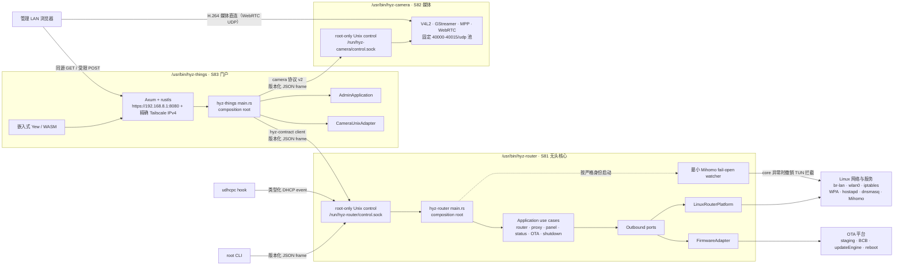
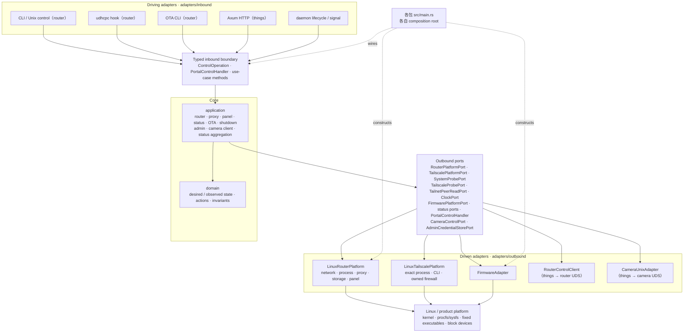
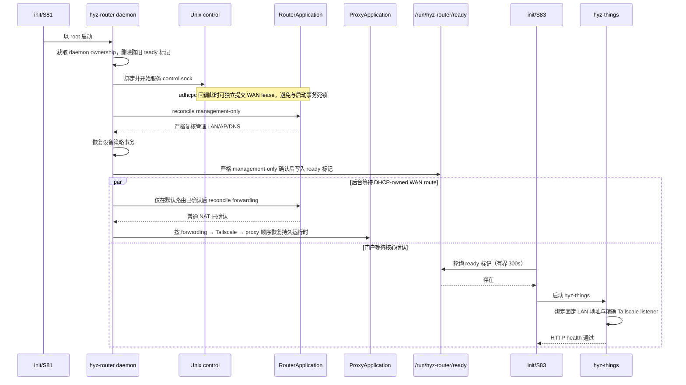

# hyz-things 三进程架构

## 目标与当前状态

路由控制面收敛为独立无头核心 `hyz-router`，管理门户为独立进程 `hyz-things`，媒体面为独立进程 `hyz-camera`。三者各自是独立的 Cargo 包、独立的板端 ELF、独立的 composition root，通过 root-only 版本化 Unix socket 契约协作：

```text
apps/rust/contract  -> 共享 wire 契约（纯 serde，无框架依赖）
apps/rust/router    -> /usr/bin/hyz-router（无头路由核心，S81）
apps/rust/things    -> /usr/bin/hyz-things（门户/管理进程，S83）
apps/rust/camera    -> /usr/bin/hyz-camera（媒体进程，S82）
```

- `hyz-router` 是**稳定的长运行服务**：拥有管理 LAN、WAN DHCP、IPv4 转发/NAT、Mihomo 代理、Tailscale 生命周期、OTA 与 shutdown；**没有** HTTP、Web、管理员认证或摄像头信令。它只服务 root-only `/run/hyz-router/control.sock`，并在严格 management-only reconcile 后才写入 `/run/hyz-router/ready` 标记。
- `hyz-things` 以「hyz things」个人网站形式承载管理面：LAN `192.168.8.1:8080`（HTTPS，自签证书）与精确 Tailscale IPv4 监听、管理员认证（Argon2id 凭据仍在 `/userdata/hyz-router/admin/credential.json`）、会话/CSRF、嵌入式 Yew SPA、camera 客户端与 Tailscale listener 管理。它等待 router ready 标记后才绑定 HTTPS，通过 `hyz-contract` client 驱动 router，通过 `/run/hyz-camera/control.sock` 驱动 camera。
- `hyz-camera` 是独立媒体进程，接受受限状态、会话、旋转请求，媒体在浏览器与固定 `40000-40015/udp` 池之间直连；它不执行网络或防火墙命令。

推送演进：`apps/rust/things/tools/deploy-app.sh` 只支持对 `hyz-things` 和 `hyz-camera` 热推送新 ELF。推送 camera/things 只停止并重启对应 init 服务，**router 永不因此重启**；`hyz-router` 的修改必须通过 OTA 发布。停止任何服务之前，工具按注册表记录的协议版本做兼容性检查（见「热推送与协议兼容窗口」）。

旧的统一单 ELF 方案（Web/Axum/管理员认证内嵌于 `hyz-router`）已完成拆分；本文档 2026-08-16 之前的 OTA 验收记录均属于拆分前的统一 ELF，作为历史验收保留。`apps/router-panel/{shared,server,adapter-linux,frontend}` 多 crate 方案此前已被否决并从源码删除；独立 MetaCubeXD 静态包也已删除，产品只保留 hyz-things 这一套管理 Web UI。

**源码、rootfs 与 recovery-free OTA 已完成三进程 cutover：** 无头 router 通过 `/run/hyz-router/ready` 标记门控门户，`S83hyz-things` 等待标记后才启动门户并自检 HTTP；`make apps` 构建三个 ELF，`make overlay` 安装三者与产品元数据。`make check` 覆盖 contract、things、router 三 crate 的 fmt/test/clippy 与部署工具 host 测试。摄像头采集固定使用 RKISP 原生 `3840×2160` 全幅 NV12，输出分辨率与码率由固定枚举的 16:9 预设选择（默认 `720p · 2.5 Mbps`，可选 `1080p · 5 Mbps`、`1440p · 10 Mbps`、`4K · 20 Mbps`，均 `@ 30 FPS`、H.264 Baseline），非 4K 预设由 `videoscale` 缩放，画面旋转由 `videoflip` 在编码前应用（0/90/180/270°，浏览器不做 CSS 旋转），时间戳水印由 `clockoverlay` 在旋转后烧入（左上角、黑底、固定 20px 字号）。真实摄像头自动验收见 [`camera-hardware-e2e.md`](camera-hardware-e2e.md)。

## 2026-08-14 摄像头 WebRTC OTA 验收

最终 1920×1080 recovery-free OTA `output/upgrade.fw` 大小为 `457,138,762` bytes，SHA-256 为 `839a316e9ec839ff084db1bddba303e1c84763182cf21c6d009e2bf95cf34ba3`。经 `rkImageMaker` 和 `afptool` 双层解包，成员只有 bootloader、U-Boot、misc、boot、rootfs 和 oem，不含 recovery 或 userdata。打包 rootfs 中的 `hyz-router`、`hyz-camera`、RKAIQ、两个 init 脚本及 V4L2、video parser、Rockchip MPP GStreamer plugins 均已提取审计，并与本次构建产物逐字节一致；rootfs 不含临时 `v4l2-ctl` 或 libv4l 诊断产物。

OTA 通过 USB ADB 传输，主机与板端 SHA-256 一致后由 `hyz-router ota install` 校验 RKFW 并写入 BCB。安装后的新 boot 恢复 Router、Mihomo、严格 Tailscale `lan_subnet_access` 和 System readiness；`hyz-camera` 由 `S82hyz-camera` 自动启动并建立 root-only control socket。recovery 分区 SHA-256 保持 `9778353401cf31b6bdca54fd1e5dd59a7a0983d9b32488eb89e3f974f036e363`，`/userdata/hyz-router` 聚合摘要在清除 OTA staging 后保持不变，原管理员 credential 未被替换或输出。

MPP 插件现在把 `GST_VIDEO_COLOR_RANGE_0_255` 映射为 `MPP_FRAME_RANGE_JPEG`，设置 `prep:range` 后强制将 encoder 配置标记为待提交。最终 OTA、打包 rootfs、Buildroot target 和板端插件的 SHA-256 均为 `f6202995874bd3bde81a59fcb61ef0dde9f5a13e7b9176018e18dd82c18d3aad`；板端采集码流经 `ffprobe` 确认为 `1920×1080`、Constrained Baseline level 4、`yuvj420p` 和 `color_range=pc`。

真实 MJS/Playwright 直接访问板端 LAN 与 Tailscale 管理页面，不使用 HTTP、WebRTC 或媒体 mock。桌面 `1280×800` 与移动端 `360×800` 四组路径均确认真实 peer connected、inbound RTP bytes/packets/frames decoded 非零、H.264 解码尺寸 `1920×1080`、canvas 像素非黑且有可见细节、全屏 stage 覆盖 viewport、无横向溢出，点击停止后 pipeline 与 active session 归零。MPP 编码码流的 SPS/VUI 经 `ffprobe` 确认为 full-range `color_range=pc`。可复用脚本与操作说明见 [`camera-hardware-e2e.md`](camera-hardware-e2e.md)，完整产品边界和审计哈希见 [`soft-router-camera-webrtc-plan.md`](soft-router-camera-webrtc-plan.md)。

## 2026-08-16 时间戳水印与画面旋转 OTA 验收

recovery-free OTA `output/upgrade.fw`（`460,284,490` bytes，SHA-256 `2375bb757bede1ef710d908eaee6b54e6de1f49fade12db1e90e72c0a3be3010`）已通过 USB ADB 安装到真实 RK3568。时间戳水印由 GStreamer `clockoverlay` 烧入编码码流：左上角、黑底、`%Y-%m-%d %H:%M:%S`，固定 `20px` 字号（DejaVu Sans，显式像素，720p 与 4K 一致），水印是编码视频的一部分而非浏览器叠加层。画面旋转从浏览器 CSS 改为服务端媒体管线属性：`videoflip` 在缩放之后、水印之前应用，「旋转画面」按 0 → 270 → 180 → 90 → 0 严格逆时针循环（前端乐观状态推进，不受状态轮询延迟影响），切换自动停止并重开直播，90/270 时输出宽高互换，水印始终在最终方向画面的左上角。为此 rootfs 新增 gst1-plugins-base pango 插件（`libgstpango.so`）、gst-plugins-good videofilter 插件（`libgstvideofilter.so`）与 DejaVu Sans 字体；camera 控制协议升至 v2（新增 `set_rotation`），Router 与 Camera 在同一 OTA 中升级。

4K 预设间歇 HTTP 503 已定位并修复：4K 冷启动（ISP 初始化 + MPP 编码器启动）首帧实测 4.3-4.5s，超过 3s 管线启动截止时间导致间歇 `media_pipeline_failed`；启动截止时间上调至 10s、router 控制超时上调至 20s，H.264 level 按帧大小选择（720p/1080p `4`，1440p/4K `5.1`，Level 4 的 MaxFS 不支持 4K），4K 稳定出流。

板端安装后的 `/usr/bin/hyz-camera` 与打包 rootfs 逐字节一致（`8b819cb7fd287b695ae5d49f139b869d354cae392d1dcebedf3545a0a27f6ef2`），`/usr/bin/hyz-router` 为 `a9d966b35c0932651605d014890db2b9d3d24d7aef56148bf039724c407428d7`；camera 纯测试二进制（SDP 校验、控制协议 v2、水印与旋转 domain）已在板端运行，8/8 通过。完整审计哈希见 [`soft-router-camera-webrtc-plan.md`](soft-router-camera-webrtc-plan.md)。

## 2026-08-16 多人观看 OTA 验收

recovery-free OTA `output/upgrade.fw`（`460,284,490` bytes，SHA-256 `5eda8d1079d5435b6e51d2941b08700808c5fbbc99139c0acda0ec5fa1b654e1`）已通过 USB ADB 安装到真实 RK3568，板端 `/usr/bin/hyz-router`（`61ca68ef97c310f8f685a98785bd501fc2970eacaa14f661618dfc1b85e7ad10`）与 `/usr/bin/hyz-camera`（`a082bcaf9e7decb3e2dad85db8355eeefe04dee07ef3b0ba321bf04d440c2797`）与打包 rootfs 逐字节一致，recovery 分区保持 `9778353401cf31b6bdca54fd1e5dd59a7a0983d9b32488eb89e3f974f036e363`。

多人观看：camera 守护进程从单会话改为共享管线 + 多会话（`MAX_VIEWERS=4`），同一编码流经 `FrameHub` 扇出到每个 viewer 的独立帧队列（零拷贝、各队列独立丢旧帧），每个 viewer 独立 UDP 端口、DTLS/SRTP 与 str0m 会话线程；管线随第一个 viewer 启动、最后一个 viewer 退出停止（引用计数 terminator，应用层幂等兜底）。第二个 viewer 不再收到 409：同一管理员账号（同一 cookie）的多窗口/多设备可同时观看；超过 4 个并发返回 503 `camera_resource_exhausted`（复用 `ResourceExhausted`，控制协议保持 v2）。router 应用层每账号会话从单个改为列表，logout/改密仍清理该账号全部会话。直播中有 viewer 时切换分辨率/旋转仍返回 409。Playwright mock 新增同账号双页面并发用例（含修复轮次 4 遗留的 CSS 旋转断言），真机脚本新增双页面并发观看验收（`active_sessions=2`、两路真实解码 720p、关闭其一不影响另一个、全部关闭后归零）。

## 摄像头媒体管线

camera 的媒体面由固定 GStreamer 管线驱动（`src/adapters/outbound/gstreamer.rs`），视频管线与音频管线各自独立、都以引用计数方式随第一个 viewer 会话启动、最后一个会话退出停止。浏览器与板端之间不经过任何服务端媒体中转：RTP 由每个 str0m 会话线程从 `FrameHub` 队列取编码帧直发浏览器的固定 `40000-40015/udp` 端口池。

### 视频采集管线

```text
v4l2src（RKISP 3840×2160 全幅 NV12，full-range BT.709，固定 30fps）
→ capsfilter（NV12 3840×2160 @ 预设帧率）
→ queue（max-size-buffers=2，leaky=downstream 丢旧帧）
→ [videoscale + capsfilter（仅非 4K 预设缩放到目标 16:9）]
→ videoflip（按 0/90/180/270° 逆时针，编码前应用，浏览器不做 CSS 旋转）
→ clockoverlay（时间戳水印：`%Y-%m-%d %H:%M:%S`，DejaVu Sans 20px，左上角黑底）
→ mpph264enc（Baseline；level 按帧大小 720p/1080p=4、1440p/4K=5.1；gop=帧率；bps=预设码率）
→ h264parse（config-interval=-1 周期重发 SPS/PPS）
→ capsfilter（byte-stream / alignment=au）
→ appsink → FrameHub 扇出
```

水印时间走 glibc `localtime`：`hyz-camera` 启动时设 `TZ=CST-8`（上海 UTC+8、无夏令时；板端 rootfs 无 tzdata，`Asia/Shanghai` 会解析失败回退 UTC，因此用等价的 POSIX 偏移串）。采集固定 RKISP 全幅再按预设缩放，非 4K 预设由 `videoscale` 完成；`mpph264enc` 输出经 `FrameHub` 零拷贝扇出给各 viewer 的独立帧队列。

### 音频采集链（对讲麦克风）

```text
alsasrc（hw:0，板载麦克风在 L 声道）
→ audioconvert → audioresample
→ capsfilter（S16LE 48kHz mono，channel-mask=FL）
→ audioconvert → audiocheblimit 高通 150Hz（4 阶）→ audiocheblimit 低通 8kHz（4 阶）→ audioconvert
→ webrtcdsp（AEC、HPF、NS high，关闭内部 AGC、limiter）
→ RNNoise + VAD 探针（nnnoiseless，480 样本帧，首帧写静音，语音概率双阈值，100ms attack / 400ms release，静音时后置 -12dB、人声时后置 +6dB 增益/限幅，非整帧透传）
→ opusenc（32kbps、20ms、DTX、audio-type=voice）
→ appsink → 各会话 str0m 音频发送
```

- `channel-mask=FL` 避免默认 (L+R)/2 混音把单麦衰减约 10dB 并混入空接的 R 声道。
- 150Hz 高通优先处理板端“呼呼声”和低频模拟扰动，8kHz 低通限制 ADC/电源宽带噪声；两者依赖 `audiocheblimit`，插件缺失时退化为不过滤。
- `webrtcdsp` 保留 AEC、HPF 和 NS high 作为互补抑噪，但关闭内部 AGC；RNNoise 的 `process_frame` 返回语音概率，探针使用 0.65/0.35 双阈值控制语音状态，在 100ms 内从静音 `-12dB` 平滑增加到人声 `+6dB`、在 400ms 内释放回 `-12dB`，避免说话触发时把残余噪声一起抬高。
- RNNoise 是采集链的最终神经网络降噪器。它使用 48kHz 的 480 样本帧；首帧丢弃以避开初始化淡入伪影。
- DTX 让静音段每 400ms 才发一帧；`audio-type=voice` 走 SILK 语音编码。

### 回放尾链（对讲喇叭）

```text
audiomixer（会话按需 request pad）→ capsfilter（S16LE 48k mono）
→ webrtcechoprobe（AEC 参考，固定元素名 webrtcechoprobe0）
→ audioconvert → audioresample → alsasink（async=false，sync=false）
```

`sync=false` 是因为管线时钟是 alsasrc 提供的从时钟（阶梯式跳变），`sync=true` 时回放会变成短突发；配合 mixer 前的 queue 吸收网络抖动实测为连续纯净播放。

## 架构图

### 运行时与外部边界



浏览器控制在 `hyz-things` 进程内经过同一个 `PortalControlHandler`，不连接 root-only router socket；CLI 和 udhcpc hook 只作为该 socket 的客户端存在。`hyz-things` 是 router/camera 的普通客户端，**不是**它们的 composition root——每个进程的完整生产 adapter 只由各自的 `main.rs` 构造。

摄像头直播使用受限边界：观看对匿名开放——浏览器从 things 领取 15 分钟短时 viewer 令牌（内存驻留、最多 128 个），令牌只允许创建/关闭自己名下的会话；画面分辨率与旋转设置仍要求管理员 session。things 通过固定 `/run/hyz-camera/control.sock` 调用独立 `hyz-camera`，并从当前 LAN 或 exact Tailscale listener 派生 candidate 地址。协商完成后，H.264 媒体直接在浏览器与 `hyz-camera` 的固定 `40000-40015/udp` 池之间流动，不经过 Axum 或 router。router 仍是唯一 firewall authority，camera 不执行网络命令。

### 每包六边形架构

三个进程各自在包内采用六边形架构，共享 `hyz-contract` 定义的类型化 wire 边界：

```text
hyz-contract  src/                  纯 serde 值对象与校验/脱敏不变量（可选 client 传输）
hyz-router    src/domain/           纯状态、值对象与不变量
              src/application/      用例与 outbound ports
              src/adapters/inbound/ CLI、Unix control、udhcpc hook、OTA CLI
              src/adapters/outbound/ network、proxy、process、storage、firmware、system、tailscale
              src/main.rs           唯一 production composition root
hyz-things    src/domain/           纯状态（re-export 自 hyz-contract）
              src/application/      admin、camera client、status 聚合、PortalControlHandler
              src/adapters/inbound/ Axum HTTP（LAN + Tailscale exact listeners）
              src/adapters/outbound/ router UDS client、camera UDS client、admin storage、tailscale listener
              src/web/              Yew/WASM 前端（web feature，只依赖 domain）
              src/main.rs           唯一 production composition root
hyz-camera    src/domain/           会话、preset、watermark、rotation 模型
              src/application/      lifecycle、ports（FrameHub 扇出）
              src/adapters/inbound/ root-only Unix control
              src/adapters/outbound/ gstreamer、webrtc
              src/main.rs           唯一 production composition root
```



实线表示运行时调用方向：外部请求从 driving adapter 进入类型化边界，核心用例通过 outbound port 请求平台能力，核心本身不反向依赖 adapter。虚线只表示 `main.rs` 在启动时完成装配，不是业务调用。跨进程的驱动/被驱动关系全部落在 `hyz-contract` 的版本化 frame 上：things 是 router 与 camera 的类型化客户端，不是它们的组合根。Yew 只在浏览器中通过 HTTP 使用 native 服务，不与 things 的 `adapters/inbound` 建立 Rust 编译依赖（`web` feature 只编译 `domain` 与 SPA）。

### Daemon 启动与就绪边界



control socket 可服务不等于 router 已就绪，router ready 标记也不等于门户已就绪。ready 标记是核心对管理面严格 reconcile 的最终确认，只有它出现后 `S83hyz-things` 才会启动门户并绑定 LAN HTTP；即使 WAN/DHCP 不可用，核心的管理 LAN/AP/DNS 也保持可用。后台恢复任务每次先确认 DHCP-owned 默认路由，再在同一 `router_proxy` 串行区内按 forwarding、Tailscale、proxy 顺序恢复；`unknown`、外部所有权或复核失败都不会被提升为 ready。push camera/things 时 router 进程与 ready 标记都不受影响；push router 后门户保持运行并自动重连 UDS。

WAN DHCP 租约按地址、metric `600` 路由、resolver 条目和 ownership record 整体提交；任一步失败都按精确动作逆序回滚。Buildroot 的 `/etc/resolv.conf -> ../tmp/resolv.conf` 在冷启动时允许目标尚不存在：adapter 只解析并校验固定 allowlist 中的目标父目录，再原子创建 `/tmp/resolv.conf`，不能因 dangling symlink 撤销已收到的有效租约。

### Ethernet DHCP 双上游演进边界

当前生产代码仍是 Wi-Fi-only：`br-lan = p2p0`、单一 `wlan0` DHCP generation/ownership、metric `600` 默认路由以及固定 `wlan0` NAT/FORWARD。`eth1` LAN member、`eth0` carrier/DHCP、有线与 Wi-Fi 共存、per-uplink resolver ownership 和 active uplink 尚未实现，不能把在线插入网线视为已支持能力。

目标演进先把固定 LAN 扩展为 `br-lan = eth1 + p2p0`，再以受限 typed uplink model 表达 `Ethernet` 与 `Wifi`。每条 uplink 分别观察 link/session/address/default-route/resolver/ownership，DHCP callback 绑定固定 uplink identity 和独立 generation；active uplink 只在 runtime-owned 地址、默认路由、NAT/FORWARD 与 resolver generation 全部严格确认后提交。`eth0` metric `100` 优先于 `wlan0` metric `600`，但 carrier 单独出现不能触发切换。

双出口 firewall 将一次性包含 `br-lan ↔ eth0` 与 `br-lan ↔ wlan0` 的固定 FORWARD、MASQUERADE 和 WAN INPUT 边界，route 切换不重建整套 chain。dnsmasq 原子使用当前 active uplink 的 resolver set；一个 uplink 的 renew/deconfig 或 stale callback 不得删除另一个 uplink 的地址、路由或 DNS。Mihomo direct/TUN、Tailscale outbound 和状态聚合必须依赖 active uplink，而不是继续读取固定 `wlan0` gateway。

这里的“下游无扰动”只保证插拔 WAN 网线时不重建 `br-lan`、不改变 LAN 地址或合法 lease、不重启 dnsmasq/AP/管理 HTTP，并保持 `eth1`、AP、LAN 内通信与本地管理入口；有线严格 ready 前新连接继续走 Wi-Fi，ready 后新连接走有线。不同出口地址和 NAT 映射下的既有 TCP/UDP 会话允许中断，不承诺会话迁移或零丢包。完整分阶段实施和验收见 [`soft-router-ethernet-dhcp-plan.md`](soft-router-ethernet-dhcp-plan.md)。

### RTL8852BS 冷启动固定流程

RTL8852BS 单射频并发启动采用稳定优先的固定顺序，不以减少 init launch 次数为目标：

1. 等待 `wlan0`、`p2p0` 出现，记录原 bridge attachment，先将 `p2p0` 从 bridge 分离；
2. 按精确 PID/start/exe/argv 身份停止上一轮自有管理进程并拒绝 foreign process；
3. 生成固定 wpa_supplicant、hostapd、dnsmasq runtime config，启动 `wpa_supplicant` 与常驻 `udhcpc`；
4. last-good 快启动优先：若持久化的 last-good 记录（`/userdata/hyz-router/sta-last-good-channel.json`，SHA-1 指纹 = committed STA 的 ssid+PSK，7 天新鲜度）与 committed STA 匹配且未过期，用 15 秒短确认窗口替代完整 45 秒等待——单射频必须先完成首次扫描/关联再编程 hostapd，否则会与驱动竞争并导致冷启动反复 relaunch（板上已实测）；窗口内拿到 STA 信道就用实际信道（单射频下即为共享信道），拿不到才回退记录信道，因此无上游场景比慢路径更快；记录无效/过期则走完整 45 秒窗口，仍拿不到 STA channel 才使用固定管理 AP fallback channel。last-good 是 runtime-derived 缓存，只在冷启动 boot 路径生效（STA apply/rollback 恒走标准等待），损坏/缺失/超龄一律回退标准等待，绝不阻塞启动；记录在管理服务就绪且观察到共享信道时写入，并在后台确认 DHCP-owned WAN route 时刷新；
5. 启动 AP 前必须主动应用 committed AP country；5 GHz 非 DFS 信道使用既有 VHT80 geometry，信道 161 必须精确读回 `secondary_channel=-1`、`ieee80211ac=1`、`vht_oper_chwidth=1`、`vht_oper_centr_freq_seg0_idx=155`；
6. hostapd 单次失败只允许一次 clean retry，每次都先停止精确自有进程、down/up `p2p0` 并重写固定配置；不得通过 `rmmod`、`insmod` 或 `modprobe` 把诊断性驱动重载带入生产启动；
7. AP 精确 ready 后再启动 dnsmasq、恢复原 bridge attachment，并复核所有管理进程身份和 AP 状态；只有这一步完成后才写入 ready 标记；
8. 任一尝试失败都必须 detach AP 并按逆序清理本轮已启动的自有进程。S81 可在总计 300 秒 deadline 内按 1、2、4、8、16、30 秒封顶退避重新启动完整 daemon；多次 launch 本身不是故障，只要 ownership 每轮完全清理并在 deadline 内达到严格 readiness。

启动时对新生管理进程的身份确认对瞬态 `/proc` 状态重试：`Command::spawn` 返回后 exec 尚未落定，第一次严格匹配失败不代表 foreign process。`identify_spawned_service` 在 5 秒窗口内每 100ms 重新快照并重新匹配，只有 deadline 前始终无法匹配才 fail closed（曾见不匹配报 `Conflict`，全程不可见报 `ProbeFailed`）。这消除了冷启动因身份竞态导致的额外 relaunch，是总启动时间压下去的正路。

2026-08-14 的正式 rootfs OTA 板测在第 4 次 launch、kernel uptime 约 92 秒时达到管理 HTTP 与同频道 VHT80 readiness。该量级已被接受为 RTL8852BS 冷启动基线；不得为了缩短时间改成 AP-first、永久 HT20、放宽 VHT geometry/readiness，或把 WAN DHCP、forwarding、Tailscale、Mihomo 放回 HTTP 前的关键路径。last-good 快启动把 45 秒共享信道等待收窄为 15 秒确认窗口（稳定部署下 STA 在窗口内关联，行为与慢路径等价；无上游时更早回退到记录信道），不改变最坏情况基线，也不违反“不 AP-first”：AP 仍然一开始就在 committed STA 的（历史共享）信道上，不做后续切信道；stale 记录（上游换信道、被指纹+新鲜度闸门约束的罕见情况）在确认窗口内用实际 STA 信道纠正，无上游时才用记录信道，因此不再有“stale 记录挡住 STA”的死锁。板上实测：直接跳过等待（0 秒窗口）会在单射频扫描期编程 hostapd、与驱动竞争导致冷启动反复 relaunch 甚至 stale-ownership 卡死，因此 fast path 必须保留短确认窗口。性能验收仍要求下游客户端连接后的实际吞吐测试，单凭 hostapd 状态不能证明恢复到历史 100+ Mbps。

多次 launch 的原始主因（新生管理进程 exec 未落定时的身份竞态）已在 5 秒窗口内改为重试而非首次不匹配即失败，板上复验确认该启动失败已消除。在编程 hostapd 前新增单射频信道就绪门：只有当 committed STA 已确认在共享信道上（`wpa_cli` COMPLETED + 频率匹配）且 RTL8852BS 驱动的当前支持信道表（`/proc/net/rtl8852bs/{iface}/cur_spt_op_class_ch`，即 hostapd “current mode channel list” 的数据源）包含该信道时才开始 AP；无上游时在窗口内降级为记录信道启动（保持 LAN-only 可用），窗口耗尽仍无信道则 fail-closed。板上复验：`Hardware does not support configured channel (161)` 类启动失败已消除，launch 次数从 4-5 稳定到 3（到就绪 112-152 秒）；剩余 launch 由射频物理沉降时间主导——驱动信号（信道表、STA COMPLETED）在关联后即“就绪”，但严格 VHT80-ENABLED 往往要再等数十秒（跨 boot 实测 70-210 秒不等，无可读信号提前预测），且存在一轮“已到 dnsmasq+attach 仍退出”的偶发后续失败（原因待抓）。启动时 device-policy recovery 也改为在生命周期锁被瞬时占有时做有界重试（镜像 DHCP worker 的 `LIFECYCLE_LOCK_WAIT` 语义），避免 startup 因锁竞争直接失败。

## Composition roots

每个进程的 `src/main.rs` 是各自唯一的装配点：

- `hyz-router` 构造：`LinuxRouterPlatform`（typed `ip`/legacy `iptables`、管理网络进程身份、网络和 Mihomo 状态）、`LinuxTailscalePlatform`（固定 `/usr/bin/tailscaled` 与 `/usr/bin/tailscale`、PID/start/exe/argv/socket/interface 身份、持久 mode/state 以及 Tailscale owned firewall）、`LinuxMihomoFailOpenPlatform`（同一 ELF 的隐藏 watcher 角色，仅负责 PID/start 绑定的 TUN fail-open）、`FirmwareAdapter`（OTA 下载、RKFW/SHA-256、BCB、`updateEngine`、reboot）、`ReadStatus`（router/proxy/tailscale/system 的部分成功聚合）与 root-only local control；就绪后写入 `/run/hyz-router/ready`。
- `hyz-things` 构造：`AdminFileAdapter`/`AdminApplication`（Argon2id 凭据，`/userdata/hyz-router/admin/credential.json`）、`CameraApplication(CameraUnixAdapter)`、`RouterControlClient`（`hyz-contract` client）、`PortalStatus`（router 不可用时返回明确 degraded 快照）、CSRF token、`PortalTls`（首次启动自签证书，`/userdata/hyz-things/tls/`）、LAN 固定 `192.168.8.1:8080` HTTPS 监听与 Tailscale exact listener 管理循环。
- `hyz-camera` 构造：pipeline/session 生命周期、`FrameHub` 扇出、str0m 会话线程与固定 UDP 端口池，root-only control socket。

`hyz-router` 的命令行：

```text
hyz-router daemon
hyz-router status [--json]
hyz-router router enable|disable
hyz-router proxy lan-tun enable|disable
hyz-router proxy tailscale enable|disable
hyz-router wifi status|scan
hyz-router wifi ap apply|confirm|cancel
hyz-router subscription get [--json]
hyz-router subscription refresh
hyz-router ota verify|download|install|install-recovery|apply ...
```

`daemon` 是正常控制路径中唯一构造完整生产 adapter 的角色。普通 CLI、同一 ELF 的 udhcpc hook 和 `hyz-things` 都是 `/run/hyz-router/control.sock` 客户端；socket 位于 root-only `0700` 目录，文件模式 `0600`，并用 Linux peer credentials 再次要求 UID 0。Mihomo watcher 是唯一的最小特权例外：它由同一 composition root 装配，只能按已记录的 core PID/start/exe/argv 身份执行 fail-open，不提供公开 CLI、HTTP 或 control operation。

OTA 和 router enable/disable 仍不通过 LAN API 暴露。匿名 LAN 页面只保留状态展示、LCD 控制和受限测速；LAN TUN、Tailscale 中继代理与已验证组内节点选择现与 AP/STA、设备别名/策略及订阅来源一起，只通过固定 typed API 暴露给已完成强制改密的管理员 session。浏览器不能提交命令、路径、原始 wpa_supplicant/hostapd/Mihomo 配置、provider 名、测试 URL 或 timeout。凭据和订阅 URL 不回显，也不允许通过 CLI 参数输入，避免进入进程列表。

## 六边形依赖规则

1. `domain` 不知道 Axum、Yew、Linux 路径、进程或命令。
2. `application` 只依赖 domain 和自身定义的 ports。
3. HTTP/CLI 只能调用 application use cases，不能直接构造或调用 outbound adapter。
4. outbound adapter 实现 application ports，不依赖 HTTP DTO 或 Yew。
5. 只有各进程自己的 `main.rs` 可以构造生产 adapter；`hyz-things` 不是 router/camera 的组合根。
6. adapter 不接受来自 HTTP 的命令字符串；外部程序只能通过固定 executable 和 typed argv 调用，禁止 `sh -c`。
7. 跨进程调用只经过 `hyz-contract` 的版本化 frame；协议版本不匹配必须拒绝（客户端精确匹配，服务端接受当前与前一版本）。

当前生命周期能力由独立 typed ports 表达：普通网络/Mihomo 使用 `RouterPlatformPort` 与 `SystemProbePort`，Tailscale 生命周期使用 `TailscalePlatformPort` 与 `TailscaleProbePort`，管理员只读 Tailnet 设备清单通过独立 `TailnetPeerReadPort` 读取；二者在 Linux adapter 中共享 `/run/hyz-network.lock`，避免并发修改统一 iptables hook。`FirmwarePlatformPort`、状态 ports 和 `ClockPort` 保持各自边界。门户侧的 `PortalControlHandler`（things application ports）把 HTTP 与 router/camera UDS 客户端隔离；`CameraControlPort` 与 `AdminCredentialStorePort` 是 things 的 outbound 边界。

## Web 状态与受限本地控制

## hyz-things HTTP 状态与受限本地控制

门户 HTTPS 由 `hyz-things` 进程承载（`S83hyz-things` 在 router ready 标记出现后才启动它），TLS 使用设备首次启动生成的自签证书（`/userdata/hyz-things/tls/`，浏览器首次访问需手动通过一次证书警告）。默认保留固定 LAN listener `192.168.8.1:8080`；`HYZ_THINGS_HTTP_PORT` 可覆盖端口，但 LAN 监听 IP 始终固定。已认证的 RouterOnly/LanSubnetAccess 还可在严格观测到的单个 Tailscale IPv4 上启动同端口的第二个 exact listener（同样 TLS），并为该地址建立独立 exact origin；地址变化时先停旧 listener，再绑定新地址。两个 listener 都不会回退到 `0.0.0.0`。匿名接口包含 `/api/v1/{health,status,panel,apps}` 与 `/api/v1/camera/{status,viewer-token}`；设置面包含以下精确接口：

- `GET /api/v1/apps`（热推送 registry 只读：名称、固定 binary/init 脚本、sha256 与协议版本；无 registry 时返回空，表示固件内置）；
- `POST /api/v1/auth/{login,logout,password}` 与 `GET /api/v1/auth/session`；
- `GET /api/v1/network/{config,pending}`；
- `POST /api/v1/control/network/sta/{scan,apply}`；
- `POST /api/v1/control/network/ap/{prepare,apply,confirm,cancel}`；
- `GET /api/v1/proxy/subscription`；
- `POST /api/v1/control/proxy/{lan-tun,tailscale}`；
- `POST /api/v1/control/proxy/subscription/{source,refresh}`；
- `GET /api/v1/tailscale`；
- `GET /api/v1/tailscale/peers`（管理员只读、严格有界的设备名、Tailscale CGNAT IPv4、在线状态与可选 OS；不返回 peer map key、用户邮箱、endpoint、密钥或原始 JSON）；
- `POST /api/v1/control/tailscale/{mode,login,logout}`；
- `POST /api/v1/control/camera/session/{create,close}`（管理员 session 或匿名 viewer 令牌二选一；创建/关闭都按令牌 SHA-256 归属 owner，只能关闭自己名下的会话）；
- `POST /api/v1/control/camera/{profile,rotation}`（仅管理员）。

没有 CORS。未知 `/api/*` 返回 JSON 404，不进入 SPA fallback；API method/path 使用精确 allowlist。所有 mutation 都要求小尺寸 typed JSON、精确管理 origin、自定义 CSRF header；AP/STA、代理模式、节点选择、设备别名/策略、订阅接口和 camera 画面设置还要求管理员 session。匿名 camera viewer 令牌本身即凭据（256-bit 随机、15 分钟 TTL、最多 128 个并发，页面领取时与后续使用都强制同源）。会停止或重启 `tailscaled` 的 Tailscale disable/logout 与两个 proxy feature mutation 只允许从固定 LAN listener 或 root-only Unix control 发起，Tailscale IPv4 listener 会返回 409，避免请求主动拆除承载自身的远程管理通道。固定用户名为 `admin`，公开 bootstrap 密码仅用于首次进入，持久层只保存 Argon2id PHC hash，并在完成强制改密前拒绝设置操作。session 只驻留内存，使用 `HttpOnly; SameSite=Strict; Path=/` cookie、15 分钟 idle/8 小时 absolute TTL 和有界登录限速；密码变化会撤销其他 session。

用户明确选择继续使用 HTTP，因此 cookie 不能设置 `Secure`，管理 LAN 上能嗅探流量的客户端仍可能获得密码、Wi-Fi 凭据、订阅 URL 或 session。这是已接受但未消除的机密性风险；WPA2 只能降低无线接入风险，不能替代 HTTPS。共享默认密码也存在首次抢占风险，首次上线应立即改密。CSRF token 不是认证：匿名 LCD 和受限测速仍沿用 LAN 信任边界；代理模式、节点选择、设备别名/策略、凭据与持久设置均额外要求管理员认证。

响应继续带 CSP、frame deny、nosniff、referrer、permissions、COOP/CORP 等安全头。Trunk 生成的 inline module bootstrap 会在 deterministic bundle 阶段被严格提取成同源 `/router-bootstrap.js`，因此不需要 nonce 或 `'unsafe-inline'`。Yew 启动需要浏览器编译同源 WASM，所以 `script-src` 精确允许 `'self' 'wasm-unsafe-eval'`；后者只开放 WebAssembly 编译，不开放普通 JavaScript `eval`。

Yew 页面按门户形态组织：顶层 `首页 / 路由器 / 摄像头` 三个视图，路由器视图内部保留 `总览 / 网络设置` 两个页内 tab。首页聚合应用入口（路由器管理、摄像头直播、门户与设置）、热推送部署记录（`/api/v1/apps`）与三张运行概览卡，摄像头入口显示免登录的可用性徽标；摄像头视图内嵌直播卡片，未登录时画面设置禁用。总览以实时链路拓扑和四项关键指标优先呈现 WAN、STA、Router/NAT、AP/LAN 与 Mihomo/TUN 的关系，再只读展示系统、WAN、LAN/AP、转发/NAT、Mihomo core、LAN TUN、Tailscale 中继代理、`wlan0` WAN 累计流量、LCD 背光、实际使用的代理组、当前节点、逐项延迟/超时和从节点名称保守推断的国家/地区。LAN TUN 与 Tailscale 中继代理两个独立开关、节点选择、设备别名/策略与订阅配置统一放在登录后的网络设置中；设备别名按 MAC 持久保存，可在默认代理策略下独立保留，避免 DHCP hostname 消失后退化为 MAC。Mihomo 内置但在当前 rule 模式不承载流量的 `GLOBAL` 组被过滤；没有数据的状态卡、控制卡和代理区域直接隐藏，不显示“不可用”占位。页面首次进入或浏览器完整刷新时只触发一次受限组级全量测速，约两秒的状态轮询不会测速；手动按钮可再次刷新，五秒内重复请求返回缓存成功结果而不是 409。组级测速覆盖 inline proxies；响应直接合并到每个显示项，缺失项标记为超时，并在节点目录不变时由 router daemon 进程内缓存保留最近结果。provider history 仍只作为初始数据来源，且只合并经过名称、数量和字段白名单校验的 `delay`/`alive`，浏览器不能指定 provider、代理组、测试 URL 或 timeout。代理节点、组名和地区属于 LAN-visible operational metadata；API 不返回 server/port、订阅 URL、密码、UUID、controller secret、原始 history 或 Mihomo JSON。写操作期间控件禁用，状态失败时保留最近成功快照。门户品牌为「hyz things」，页面标题与 `index.html` 的 `<title>` 一致，不再使用“HYZ Router”标识。

网络设置页签在未登录时只显示默认折叠的管理员登录摘要，按需展开登录表单；登录后提供代理模式与节点选择、设备显示名与代理策略、STA 扫描/手工切换、AP SSID/密码/国家码和 write-only Mihomo 订阅来源。AP/STA 面板默认折叠，按需展开；STA 或 AP 应用先在管理设置区显示内嵌风险确认 panel，不使用模态弹窗或页面遮罩。确认后先移除确认 panel 并折叠详情，等待浏览器完成渲染后才发送可能中断管理连接的请求。typed Wi-Fi 配置使用 PBKDF2 派生的 64-hex PSK和固定 renderer，不拼接 raw 配置。STA 只有在关联、DHCP metric-600 route 与同信道 AP readiness 都确认后才提交，失败恢复 committed generation；当前 renderer 对 2.4 GHz 使用 HT20，对受支持的非 DFS 5 GHz 同信道使用既有 VHT80 profile，并对 secondary channel、802.11ac、VHT width 与 center frequency 做精确 readiness 复核；诊断中可启动的 HT20 只用于隔离驱动状态问题，不作为生产性能降级。5 GHz 候选仍只有在 STA 关联、DHCP metric-600 route 与同信道 VHT80 AP readiness 都确认后才提交。AP 采用 prepare → apply → 重新连接 → confirm，两分钟未确认则恢复旧 AP，daemon 重启发现 pending 也恢复 committed 配置。订阅只接受 HTTPS 公网目标，关闭 redirect/环境代理，使用固定 `clash.meta` User-Agent 请求 YAML，连接前校验并 pin 全部 DNS 结果；响应受 4 MiB 上限约束，必须包含唯一顶层 `proxies`，其他 Clash 配置字段会被丢弃，只有经过严格限制的节点数组进入本地候选。Mihomo 候选验证和 live readiness 成功后才切 current generation。GET 只显示是否配置与通用状态，不返回来源、host、代次或节点数。

登录后的 Tailscale 卡片还会独立读取管理员专用 Tailnet 设备清单：摘要显示在线数/总数，折叠列表只显示有界设备名、单个 `100.64.0.0/10` IPv4、在线/离线与可选 OS。列表失败不会拖垮本机 Tailscale 生命周期状态；已有成功快照会保留并明确标记“数据可能已过期”，首次失败与空 Tailnet 分别显示不可用和空状态。这里的“在线”只表示设备连接到 Tailnet，不表示正在访问本路由器 LAN；页面不提供踢设备、tags、ACL、路由批准或其他 Tailscale 写操作。

LCD 的 DTS `default-brightness-level = <0>` 让 U-Boot/Linux 冷启动默认保持零 PWM，但 panel/DSI 仍注册，因此 Web 可以点亮。黑屏操作把 brightness 设为 0 并 powerdown；面板连接的是共享 always-on `vcc5v0_sys`，软件不能让 LCD 连接器 5V 物理归零。

状态 probe 直接调用固定的 `/usr/sbin/wpa_cli`、`/usr/bin/hostapd_cli`、`/usr/sbin/ip`、`/usr/sbin/iptables` 并读取固定 procfs/sysfs，不调用 `/usr/sbin/hyz-router` 或 `/usr/sbin/hyz-mihomo` wrapper。

## 热推送与协议兼容窗口

`apps/rust/things/tools/deploy-app.sh` 只允许热推送 `hyz-things` 和 `hyz-camera`（`make deploy-things|deploy-camera`，回滚 `make revert-things|revert-camera`，预检 `deploy-app.sh check NAME`）。`hyz-router` 不属于热推送范围，所有 router 修改必须通过 OTA 发布。

- 推送流程：adb 推送 ELF 到 `/userdata/hyz-things/apps/<name>/<sha256>/` → 远端 SHA-256 校验 → **只停止目标应用的 init 服务**（S83/S82）→ 同文件系统原子替换 `/usr/bin/<app>` → 启动 → 就绪探针 → 写注册表。
- 服务隔离：推送 camera/things 绝不调用 router 的 init 脚本；`assert_router_untouched` 在推送前后断言 `/run/hyz-router/ready` 仍在，门户保持运行并自动重连 UDS。
- 注册表：持久 `/userdata/hyz-things/apps/registry.json` 记录每个已部署二进制的 sha256 与 wire 协议版本（`protocol_versions`），每次部署保留 previous 条目供回滚；`/run/hyz-things/apps/<name>.json` 是当前启动的易失快照。
- 协议兼容窗口：`hyz-contract` 的 wire 契约版本化，服务端接受当前与前一版本（`[current, current - 1]`），客户端要求精确匹配。deploy 与 revert 在**停止任何服务之前**按注册表记录版本做兼容性检查：推送 things 时要求已装 router/camera 版本相等；推送 camera 时要求已装 things 的 camera 期望版本相等。回滚按 previous 条目**记录的**版本校验（而不是当前源码树），防止源码已前进时错误放行。
- 测试：`tools/test-deploy-app.sh` 用 fake adb 断言 router 不可热推送、服务隔离、先拒绝后停止和回滚按记录版本把关；`make check` 与 `check-static` 均覆盖。

## 路由与 Mihomo direct adapter

当前已建立的领域模型把管理平面和转发平面分开，但生产实现仍是单 Wi-Fi WAN：

- management LAN：当前为 `br-lan`、`p2p0`、DHCP/DNS；目标在独立 member 生命周期完成后扩展为 `br-lan = eth1 + p2p0`；
- WAN：当前为 `wlan0`、单一 DHCP generation/ownership、metric `600`；目标为 typed `Ethernet/Wifi`、per-uplink DHCP/route/resolver ownership 与显式 active uplink；
- forwarding：IPv4 forwarding 和普通 NAT；当前 exact rules 固定 `wlan0`，双上游阶段扩展为固定 `eth0`/`wlan0` 双出口且切换不重建 chain；
- proxy：独立的 `lan_tun_enabled` 与 `tailscale_explicit_proxy_enabled`，共享派生的 Mihomo core；双上游后 direct/TUN 出口跟随严格确认的 active uplink。

`router disable` 的模型先把 Tailscale LAN path 降到 RouterOnly，再以 runtime-only reconcile 撤销 LAN TUN interception，最后移除 ordinary forwarding/NAT；管理 LAN、页面、Tailscale 认证状态、Tailscale access mode 以及两个 proxy feature desired 均保留。恢复 forwarding 后会重新 reconcile 持久 Tailscale 与 proxy feature intent。

Rust candidate 当前覆盖：

- `/run/hyz-network.lock` 的保守目录锁：PID/start-time stale 判定，完整 owner 原子发布，按目录 inode 原子移出后回收或释放；
- bridge ifindex、iptables exact rule/hook 和 comment-token ownership；
- 全局 `ip_forward` 在首次变更前保存，daemon shutdown 最后恢复启动前值并删除 ownership marker；
- WPA、udhcpc、hostapd、dnsmasq 的固定 argv 与 PID/start/exe/argv 身份；
- DHCP lease generation 的地址、route metric `600` 和 resolver 所有权记录；
- 冷启动两阶段 reconcile：先启动离线可用的管理 LAN/AP/DNS，再仅为 forwarding 执行有界 DHCP route 等待和所有权复核，最后提交 firewall/forwarding；
- `SIGTERM` 先停止 watcher/撤销 TUN，再撤销普通转发并按精确身份停止管理进程，最后删除自有 bridge；
- Mihomo source 约束、受控 `tun:` 替换、persistent data/runtime state 分离；source 不能控制 listener/controller/UI/secret/TUN，runtime 固定生成 `127.0.0.1:7890` local-only mixed port、双 UUID controller secret 和 `127.0.0.1:9090` controller；
- controller 启动前经过 authenticated `/version` readiness；浏览器只经过固定 typed facade，不能直连 controller；公开组/节点数据经过长度、成员关系、字段白名单和响应上限校验；
- TUN exact chain、policy route/rule、`rp_filter`、interception commit-last；
- 同一 ELF detached watcher、严格 core/watcher 身份和 ordinary-NAT fail-open；
- 版本化 `features.json` 将 LAN TUN 与 Tailscale 中继代理 desired 独立持久化，Mihomo core 由二者派生；旧 `disabled/explicit/tun` 只执行保守迁移，未知值不删除；
- `tailscaled` 仅允许 fixed Direct 或 `HTTP_PROXY`/`HTTPS_PROXY=http://127.0.0.1:7890` 两组 exact environment；共享 core reload 前先切 Direct，恢复后再切回代理；
- strict observed readiness，unknown/foreign 绝不当作 ready。

Host 与板端 parity 已建立：`hyz-contract`/`hyz-router`/`hyz-things` 各自的 `Cargo.lock`、native 测试套件、严格 Clippy、Trunk release bundle、连续两次一致的 deterministic tar、嵌入真实前端的 AArch64 ELF、Buildroot rootfs、kernel 和 recovery-free OTA 均已通过；三进程拆分后的 `make check` 覆盖 contract/things/router 的 fmt、test、Clippy 与部署工具 host 测试。统一运行时的 Web LCD/代理控制、节点切换与恢复、延迟、真实 Mihomo core 崩溃 fail-open、普通 NAT 和 TUN 恢复已在拆分前的统一 ELF 上完成板测（历史记录见下文各节）。2026-08-10 Web 稳定性固件曾暴露 S81 固定 launch 次数窗口不足；2026-08-11 设置事务固件已安装封顶指数退避版 S81，并通过自动冷启动与 SysV restart 验收。

2026-08-14 新增的 Mihomo shared core + LAN TUN/Tailscale 中继代理双 feature 层已完成主机静态检查、Rust 测试和 Chromium 桌面/360px E2E；该新层尚未部署到 RK3568，也未执行四组合、Mihomo `SIGKILL` 后 Tailscale Direct 恢复、固定 CONNECT 路径探测和长时间稳定性板测。此前板测结果不能替代这组新增验收。

仍保留以下边界：

1. `updateEngine` 的 recovery-free BCB、staging、重启和最终分区结果已板测；任意 URL 下载路径的端到端网络 deadline 与目标 block-device provenance 仍需单独故障注入；
2. Mihomo 受控键仍采用与已验证 shell 相同的保守文本策略，尚未升级为结构化 YAML 验证；
3. 已看到一个 AP 客户端和非零 TUN/NAT 计数，但最终固件上的手机 TCP/UDP/视频主观验收仍需用户完成；
4. cold boot 后 backlight `brightness=0`、`actual_brightness=0` 已确认，尚无摄像或人工观察记录可独立证明 U-Boot 到 Linux 全程没有瞬时闪光。

## OTA 合并

现有 `hyz-ota` 能力已迁入同包的 domain/application/firmware adapter，最终 CLI 形式为 `hyz-router ota ...`。保留：

- RKFW magic 和 SHA-256；
- normal/recovery OTA 分离；
- 16 KiB BCB offset、1088-byte exact readback；
- pending command 拒绝；
- `updateEngine` 后验 BCB 验证；
- staging 成功后才可 reboot。

固件输入现在通过 `O_NOFOLLOW` 打开并持有 trusted file descriptor，复制到固定的 root-only `/userdata/hyz-router/ota/upgrade.fw` staging 后再验证。SHA-256、RKFW prefix、fsync 和 staging 前复核都基于同一 device/inode/size 身份；下载临时文件保持打开，验证成功后才 atomic rename 并 fsync parent。OTA mutation 使用独立目录锁；迁移切换时必须原子移除旧 `hyz-ota`，两套 updater 不允许并存执行。SHA-256 仍只是完整性检查，不是发布者认证；签名、anti-rollback、A/B/rollback 仍在生产安全边界之外。

## TDD 与构建闸门

已放置的测试层包括：

- `hyz-contract`：21 个 wire 类型/校验/脱敏测试；
- `hyz-router`：status Serde/秘密排除、partial degraded aggregation、network/proxy action order、rollback、unknown non-readiness、Tailscale 生命周期、OTA BCB 与 verify-before-commit；
- `hyz-things`：real random-port Axum/security/fallback HTTP 测试；非默认 `e2e` feature 的 loopback-only Axum harness（bin `hyz-things-e2e`）：真实 HTTP/CSP/CSRF/Origin/管理员应用，状态、面板、Wi-Fi、订阅与 camera 通过 application ports/typed `PortalControlHandler` fake 注入，不构造生产 outbound adapter；部署工具 host 测试（`tools/test-deploy-app.sh`）；
- Playwright Chromium 浏览器流程：首页应用入口与部署记录、总览/代理/网络设置页签导航、匿名摄像头观看与管理员画面设置、链路拓扑和关键指标、匿名状态与控制、bootstrap 强制改密、STA/AP 事务及内嵌非模态风险确认 panel、write-only 订阅、可访问性与窄屏无横向溢出；
- Tailwind CSS 4 + daisyUI 5 `dracula` 默认主题的 locked npm 静态 CSS 生成（`npm run build:css` 输出被 gitignore 的生成 CSS），以及 deterministic bundle 的 CSP-compatible external bootstrap；
- Yew formatting/state 与单一 WAN 流量口径；
- deploy-app.sh 的 fake-adb 服务隔离与协议兼容矩阵测试。

仓库本地固定版本 Trunk、locked Node 前端依赖和显式构建/浏览器测试入口：

```sh
(cd apps/rust/things && npm ci)
cargo install trunk --locked --version 0.21.14 --root .tools/trunk
make things-frontend
make things-e2e
make things-app
```

`things-frontend` 先执行 Tailwind/daisyUI 静态 CSS 再执行 Trunk/Cargo release WASM build 并产出 deterministic tar（`target/frontend-bundle/hyz-things-frontend.tar`，由 `build.rs` 经 `HYZ_THINGS_FRONTEND_ARCHIVE` 嵌入 ELF）；`things-e2e` 使用 host-only loopback Axum harness 运行 Playwright，不执行产品网络命令；`things-app` 再完成资源嵌入和 AArch64 native build。由于 Trunk 0.21.14 默认的 Binaryen 版本不能接受当前 rustc 产生的标准 WASM 特性，前端显式禁用可选的 `wasm-opt` 二次处理；Cargo release 的 LTO/strip 保留。最终 tar 连续构建 SHA-256 一致，AArch64 ELF 已确认嵌入真实资源并逐字节进入 rootfs。`make check` 覆盖 contract/things/router 的 fmt、test、严格 Clippy 与 `test-deploy-app.sh`。

## 2026-08-10 Web 稳定性 OTA 与板端结果

| 产物 | SHA-256 |
| --- | --- |
| `output/upgrade.fw`（378,495,562 bytes） | `e1f771422ec08de32c4f23263d62f6905e5d712ec12849a6cac5350f1c6ea655` |
| 打包 `boot.img` | `1142514684745fb933da025cd39aa1d0a0a81d3e62c46d1d774320da0954454f` |
| 打包 `rootfs.img` | `17993e58abe1728a0e69c85b24cc12c76d6971c36f5a4b025522f33fceb02033` |
| `/usr/bin/hyz-router` | `27655c741ad48563cce79784f2fdbabd9225f3f860b4077ff7c1230436982460` |
| `/etc/init.d/S81hyz-router` | `678a058a94b888be368996a99197f569f1aad802b11d399783985c5134219671` |
| deterministic frontend tar | `d8f5dd31c5ea9ad280e9210fe1a328983430b0edd3f9578246942d30396bba94` |

OTA 解包成员只有 bootloader、U-Boot、misc、boot、rootfs 和 oem，不含 recovery/userdata。安装后 ELF 与打包 ELF 哈希一致，稳定 userdata 配置和 recovery 保持不变；最终 rootfs 没有 bind mount，只安装一个产品 ELF，已审计的旧产品路径均不存在。

本轮 Web 修复使用按 bundle 内容生成的版本化 `/router-bootstrap.js?v=<hash>`，bootstrap 和 SPA HTML 返回 `no-store`，缺失的旧 `.js`、`.wasm`、`.css` 等静态资源返回 404 而不是 SPA HTML。板端验证确认版本化 bootstrap、严格 CSP、正确 WASM MIME/magic、provider 全量测速入口、节点选择持久化和 Web API 均正常。真实 provider、节点名称、数量、延迟分布、余额和控制 token 属于本地运行数据，不写入本文或 Git。

该 Web 稳定性 OTA 冷启动时，Wi-Fi 完整就绪晚于当时 S81 的固定五次 launch 窗口；脚本在约 143 秒停止，而约 168 秒后的显式 `start` 立即成功。恢复后 router/TUN 状态、Web、版本化 bootstrap、静态资源 404 和选择持久化均持续正常，因此 ELF 与 Web 修复本身有效，但该轮自动冷启动未通过。后续设置事务 OTA 已删除固定 launch 次数上限，采用总 deadline 内 `1、2、4、8、16、30…秒`的封顶指数退避，并完成冷启动与 restart 验收，见下节。

本轮审计资料位于忽略的 `output/audit/router-web-stability-20260810/`，其中可能包含设备运行元数据，仅供本地验证，不提交或发布。

## 2026-08-11 设置事务与 init 生命周期板测

最终安装的 recovery-free OTA：

| 产物 | SHA-256 |
| --- | --- |
| `output/upgrade.fw`（379,544,138 bytes） | `c1d0cc5ad957d6f0626bd780394a31e45f54d18f88ddd96ab73aba38df57489d` |
| 打包 `boot.img` | `51c15ea143283b4d660a7523b7ebe09a36f8b634ede54e2d3266aae271995c90` |
| 打包 `rootfs.img` | `50b5a72b2f711800f75bdb1a4155bcdec40e66c71d9f84026faf6dca00cce25b` |
| 打包 `oem.img` | `d6ccd8190cb4990c57e09814f30b03e524bc0a59c0abeb4a066cd81e0cc97182` |
| `/usr/bin/hyz-router` | `a53cb8e00717dcc10eb4c683729a03c0351fce18a05e2ef2cec9f3ac74f84786` |
| `/etc/init.d/S81hyz-router` | `a3c4741821adb3db8c3f997dbd5c0c45a2db31be529ae43e08829f56e5c165cd` |

OTA 再次经 `rkImageMaker` 和 `afptool` 解包；成员只有 bootloader、U-Boot、misc、boot、rootfs 和 oem，不含 recovery/userdata。rootfs 内 ELF/init 与构建输入逐字节一致，且没有生成的 STA rollback journal。

板端结果：

- 冷启动最终达到 STA `COMPLETED`、AP `ENABLED`、metric 600 默认路由、`br-lan`、HTTP health 和无网络事务锁的完整 readiness；
- 不存在的 STA 候选在约 114.5 秒后返回失败，canonical 配置哈希不变，旧 STA/路由/AP/bridge 自动恢复，无 journal 残留且无需重启板卡；
- 临时 AP 候选成功 prepare/apply；未 confirm 后由 120 秒任务自动恢复，canonical 哈希一致，pending/applied 记录清除；
- 首版 init action lock 虽能串行入口，但 FD 被 daemon 继承，导致 restart 和 OTA 关机 stop 等待。最终脚本在启动 daemon 时显式 `9>&-`，板端确认所有进程均未持有该锁；
- 最终 SysV restart 在 21 秒内完成，前后 STA/AP/route/HTTP readiness 正常；两次并发 idempotent start 均成功；
- 最终无 STA/AP transaction、OTA staging 或 init-lock holder 残留。

板端当前没有配置新式 write-only 订阅 URL，因此只验证了摘要不返回 URL/token，未执行真实刷新。成功切换到另一组真实 STA、AP confirm 后长期使用、管理员实际改密和订阅刷新必须由操作者在面板输入本地凭据后继续验证。真实 SSID、密码、订阅 URL/token 和 provider 数据均未写入日志或版本库。最终本地审计资料位于忽略的 `output/audit/init-fd-close-20260810/`。

## 2026-08-11 订阅兼容与 Wi-Fi 设置交互 OTA

随后安装的 recovery-free OTA：

| 产物 | SHA-256 |
| --- | --- |
| `output/upgrade.fw`（379,544,138 bytes） | `a27d097c1b994796a33bd3bdd80525cef794e2296412d5bef4c11c68c89f9a43` |
| 打包 `boot.img` | `cf94ae3281bd4fbf7186f53f4751a3914b68563e9fac26a57526147d3ea751d1` |
| 打包 `rootfs.img` | `21052f67d827a5f2c4f903f49ea594c861a9691b98f9181886ced923bbed8479` |
| 打包 `oem.img` | `5393359eaeeec3748b4409ffb1fa093babe0543f30d04a1ffed1d90e9b1d0017` |
| `/usr/bin/hyz-router` | `09fb43a7333558d31452f22db9a073f0d5f837d7927bbca346578a2f5996541a` |
| `/etc/init.d/S81hyz-router` | `a3c4741821adb3db8c3f997dbd5c0c45a2db31be529ae43e08829f56e5c165cd` |

该 OTA 再次经 `rkImageMaker`/`afptool` 解包，成员仅含 bootloader、U-Boot、misc、boot、rootfs 和 oem，不含 recovery/userdata；构建 ELF、Buildroot 安装副本和 rootfs 内 ELF 逐字节一致。

订阅下载现在以固定 `clash.meta` User-Agent 和 YAML Accept 请求格式。完整 Clash YAML 仍经过文档大小、深度、节点数量、重复键、引用/tag 和字段形状限制，只提取唯一顶层 `proxies`；controller、规则、代理组和其他服务端字段不会进入本地 source。板端使用已保存的 write-only 来源刷新成功，公开摘要由 `failed` 变为 `active`，至少一个不可变 generation 已提交，TUN core、精确 iptables 链、mark rule 和 table 110 默认路由保持 ready。验证过程未读取或输出 URL/token、节点内容或 provider 数据。

设置页不再常驻展示“当前网络 + STA + AP”多块表格：STA/AP 各自显示一行当前摘要并默认折叠，点击后按需展开。STA 应用和 AP apply 共用确认弹窗；确认回调先关闭弹窗、折叠详情并等待 150 ms 浏览器渲染窗口，再发起可能断开管理连接的请求。板端已确认版本化 WASM/CSS 资源及折叠/弹窗样式进入安装 ELF；使用真实凭据触发断网操作后的主观视觉时序仍由操作者在浏览器完成最终验收。本轮忽略的本地审计资料位于 `output/audit/subscription-wifi-ui-20260811/`。

## 2026-08-11 节点测速与登录折叠 OTA

最终安装的 recovery-free OTA：

| 产物 | SHA-256 |
| --- | --- |
| `output/upgrade.fw`（379,544,138 bytes） | `5c04aa6bf90b3c9cff53c8016641ae5f27b9cb4c26f7a9dd6f772e976d460fd4` |
| 打包 `boot.img` | `7e86de4e901d2c672aaf0c62f56fd6e6fee60439ca0fec45f1efd85bcd7a665b` |
| 打包 `rootfs.img` | `134fda8a276656fbc5ab5efd8701e1b2ff628ee9c17d4237e660795146581430` |
| 打包 `oem.img` | `43c0fbe5e3dfae23f4bebf4f6c36071015880e661cb9d9bc55a034e8cf16973a` |
| `/usr/bin/hyz-router` | `057c9b8252b9f18ff0c60884a2c721c6f2d2e176cbd076c1137b28d6ceb9b830` |
| `/etc/init.d/S81hyz-router` | `a3c4741821adb3db8c3f997dbd5c0c45a2db31be529ae43e08829f56e5c165cd` |

OTA 经 `rkImageMaker`/`afptool` 解包，成员仍只有 bootloader、U-Boot、misc、boot、rootfs 和 oem，不含 recovery/userdata；构建 ELF 与 rootfs 内 ELF 逐字节一致。安装后 STA、AP、转发、TUN 和 Mihomo 均恢复 ready，板端 ELF 哈希与打包值一致。

全量测速改用 Mihomo 组级 delay API，因此订阅导入的 inline proxies 也会逐项测量。调用规划按覆盖率贪心去重并限制最多 16 个组请求；返回值直接合并进显示项，未返回的项明确标记为超时。最近一次完整结果按当前节点名称集合保存在 daemon 进程内缓存中；节点目录变化时缓存失效，避免把旧节点结果映射到新目录。板端匿名统计验证手动响应覆盖 16/16 项（15 项数值、1 项超时），随后重新读取 panel 仍覆盖 16/16，未记录节点名或 provider 数据。

页面首次获得非空代理组后会在无管理员 session 时自动触发一次同源 CSRF 保护的全量测速；管理员登录表单改为默认折叠、按需展开，登出时重新折叠。已安装 ELF 与包含这些前端变更的构建产物一致。
