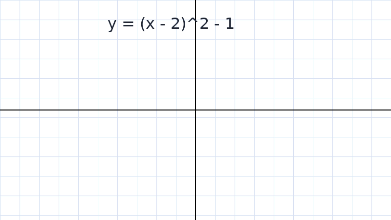

---
tags:
  - latex
  - image
  - demo

---

## Card
<!-- hyz-card-id: 019a31b7-8c42-7c16-a6d1-0c1f0f34c821 -->

### Front

**二次函数的顶点**

给定

$$
f(x)=x^2-4x+3
$$

求顶点坐标，并判断开口方向。

### Back

配方得到

$$
f(x)=(x-2)^2-1
$$

因此顶点是 $$(2,-1)$$，二次项系数为 $1>0$，所以图像开口向上。

---
