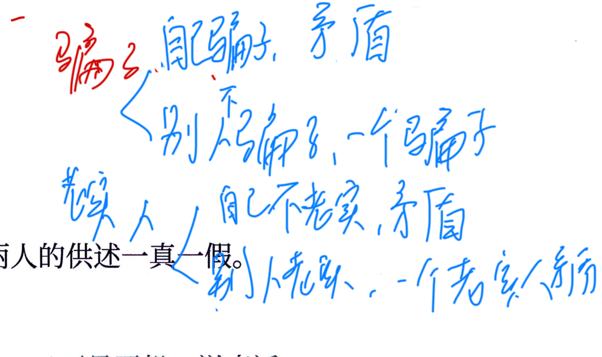

---
tags:
  - 判断
  - 形式推理
  - 公务员考试
---

## Card
<!-- hyz-card-id: 01a115c8-073c-72b0-8f43-629caeefa6de -->

### Front

真假话问题

### Back

--

---

## Card
<!-- hyz-card-id: 01a115c8-073c-72b0-8f43-62a9c2c8dc0a -->

### Front

命题之间的真假关系：

1. **矛盾关系：永远最优先**
   - 两个命题矛盾：必然一真一假。
   - 例：
     - $A \to B$
     - $A \land \neg B$

2. **全覆盖关系：至少一真**
   - 两个命题可以覆盖全部情况。
   - 例：
     - $A \lor B$
     - $A \lor \neg B$

3. **反对关系：至少一假**
   - 两个命题反对、不交叉，无法覆盖全部情况。
   - 例：
     - $A \land \neg B$
     - $\neg A \land B$

4. **包含关系：真往下推，假往上推**
   - 若命题 $A$ 包含命题 $B$：
     - $A$ 真 $\Rightarrow B$ 真
     - $B$ 假 $\Rightarrow A$ 假
   - 例：
     - $A \to A \lor B$
     - $A \land B \to A$

5. **找关系优先级**
   - 只有一真：优先找 **矛盾**，其次找 **全覆盖 / 包含**
   - 只有一假：优先找 **矛盾**，其次找 **反对 / 包含**

6. **做题步骤**
   - 先通过命题关系确定其他命题真假；
   - 再把确定出的真假反代回矛盾命题，判断矛盾命题内部谁真谁假。
   - 排除法可以快速出答案，推不出来所有情况时，利用假设法

> 记忆：**"或"扩大范围，"且"缩小范围。**

### Back

--

---

## Card
<!-- hyz-card-id: 01a11673-f893-71f3-b885-d28ba3367d77 -->

### Front

两难推理衍生模型----**选人优先级问题**

从 $n$ 个对象中选出 $m$ 个：

1. **若选 A，则选 B**
   - $A \to B$
   - **B 被选中的优先级永远高于 A**

2. **判断 B 是否必选**
   - 若比 B 优先级低的对象个数 $\ge n-m$
   - 则 **B 必选**

例：

3 位候选人小李、小王、小刘中选 2 位。

若"选小李 $\to$ 选小刘"，则：

**小刘的被选优先级 > 小李。**

### Back

--

---

## Card
<!-- hyz-card-id: 01a11673-f893-71f3-b885-d29b0053dc9c -->

### Front

假言命题和选言命题可以互相转化：

$$
A \rightarrow B \equiv \neg A \lor B
$$

判断两个命题是否等价，只要看：

- **矛盾面是否一样**
- 或者 **所有真假情况是否完全一样**

只要二者的矛盾面相同，或者在所有情况下真假结果都相同，就可以互相转化。

### Back

--

---
