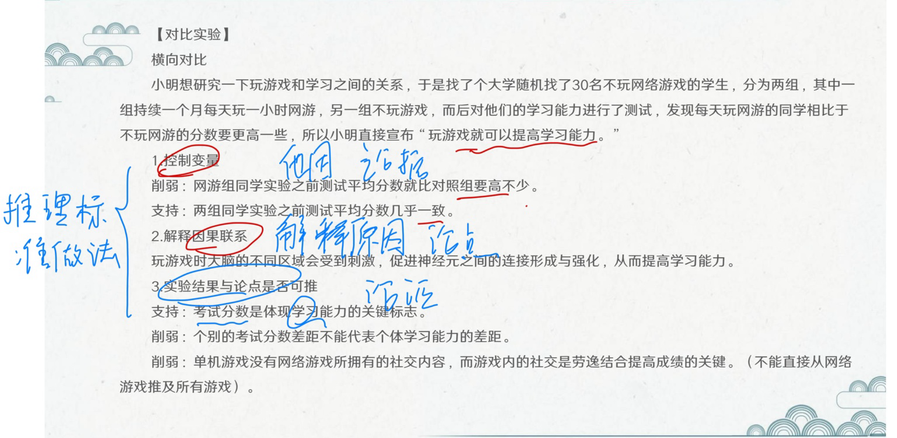
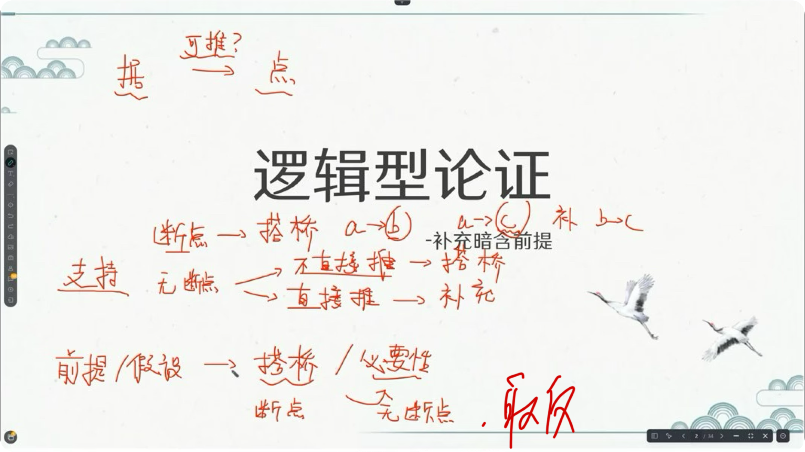

---
tags:
  - 判断
  - 论证推理
  - 公务员考试
---

## Card
<!-- hyz-card-id: 01a11207-c2f0-7606-8d8f-9eb6ed90eb33 -->

### Front

论证推理的核心是是否可推，论据->论点

削弱的优先级是：否论点(因果倒置 ) -> 拆桥（论证）-> 论据(他因) -> 反例

因果倒置和他因是由果推因才有的,由果推因都暗含对照试验(横向)

对照试验有横向比较和纵向比较,纵向是自己和自己比

### Back

**横向对比实验：**

**加强：**

---

## Card
<!-- hyz-card-id: 01a12036-cc66-7bc0-a75f-4e118ad1e851 -->

### Front

由果推因题中，如何划分暗含的实验组和对照组？

实验组与对照组是否一定是全覆盖关系？如何识别他因削弱？

### Back

**1. 由果推因**

观察到 A 与 B 有关联 → 推断 A 导致 B。

**2. 暗含分组**

- 实验组（类比）：具有研究因素 A 的人群。
- 对照组（类比）：作为比较基准的人群。
- **两组不一定全覆盖，也不一定构成非此即彼的关系。**不能把「非实验组」直接等同于「对照组」。

**3. 例题：脂肪过少与死亡风险升高有关**

- 实验组：脂肪含量过少的人群。
- 可能的对照组：脂肪含量正常的人群（具体以题干为准）。
- 脂肪含量过多的人群：不一定属于对照组，可能是单独的第三组。

题干说「过少与风险升高有关」，不代表「正常或过多均与风险无关联」。

**4. 他因削弱**

- 实验组角度：实验组死亡风险高，可能是患病更多造成的。
- 对照组角度：对照组死亡风险低，可能是生活习惯更健康造成的。
- 共同原因：疾病可能同时导致脂肪过少和死亡风险升高。

**5. 干扰项辨析**

「脂肪过多比脂肪过少死亡风险更高」只是比较同一因素的不同水平，不否定脂肪过少相对正常水平风险升高，也不是他因。

**核心：分组看实际比较基准，不擅自扩大对照组；他因看是否有其他因素能够解释结果差异。**

---
