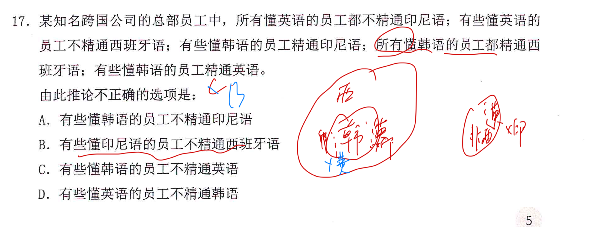
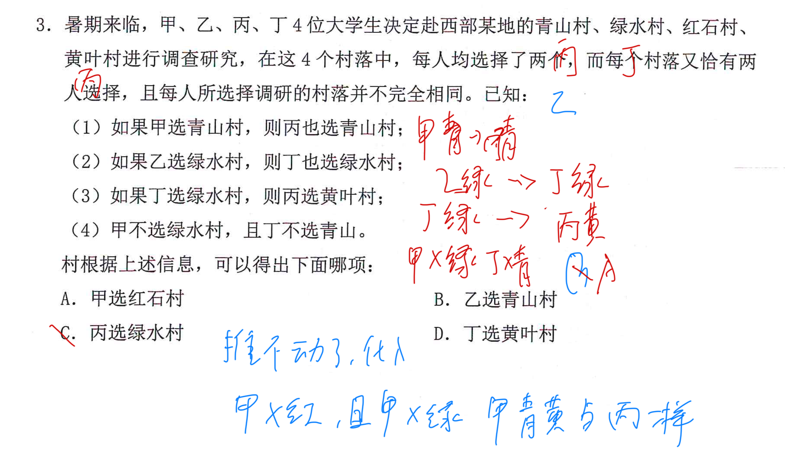

---
tags:
  - 判断
  - 错题
  - 公务员考试
---

## Card
<!-- hyz-card-id: 01a1164e-08ae-7cc0-925b-427693893cbd -->

### Front

甲、乙、丙、丁、戊是同班同学，在某次寒假聚会上，每人就寒假作业的完成情况分别说一句话：

甲："我和乙、丁、戊中，只有一人没完成作业。"

乙："我和甲、丙、丁中，有三人没完成作业。"

丙："除丁外，我们四人都完成了作业。"

丁："甲和乙没完成作业。"

戊："甲和丙没完成作业。"

若完成作业的人说真话，没完成作业的人说假话，且每个人都知道其他四人的作业完成情况，则没完成作业的是：

A. 甲、乙、丙  
B. 甲、丙、丁  
C. 甲、乙、丁  
D. 丙、丁、戊

### Back

从选项知，一人为真

---

## Card
<!-- hyz-card-id: 01a1164e-08ae-7cc0-925b-428257d1c362 -->

### Front

某大型餐饮服务企业在全公司范围内发起了"最受欢迎员工"的评选活动，获得"最受欢迎员工"称号的人会获得公司的奖励，最终市场部的小兰以三分之一以上的票数获得了这一称号，因此小兰是全公司最受欢迎的员工。

下列选项最能削弱上述结论的是：

A. 公司的高层干部都没有参与这次活动，也没有投票

B. 小兰的有力竞争者小花由于上个月离职了，并没有参与评选

C. 评选后发现小兰的票数存在造假，实际上的票数只能排在第二

D. 参与投票的员工里有些是随便选的，并不认识小兰

### Back

D. 有些没有表明具体量级，只知道有,甚至都没说投了小兰 不能否定票数最多就是最受欢迎的人

直接大于间接

---

## Card
<!-- hyz-card-id: 01a1166a-90f7-7d00-869f-2af741382ba9 -->

### Front

### Back

所有懂英语的都不会印尼语，即所有懂印尼语的都不懂英语

---

## Card
<!-- hyz-card-id: 01a1169b-7a58-75d2-8da2-37b7ea208408 -->

### Front

### Back

推不动了就代入，证明为真就取反，证明为假直接代

---

## Card

### Front

为什么青少年会更"热血"，更冲动，更容易冒险，有研究显示，这跟青少年大脑前额叶皮层的功能有关。前额叶皮层具有负责调控注意力、作出计划、理性思考、调控情绪的能力，这部分皮层一般要等到25岁左右才能发育完全。因此，25岁之前谈理智是没有意义的。

以下各项如果为真，哪项最能质疑上述结论：

A. 青少年时期的大脑中多巴胺的分泌很旺盛，使得青少年更喜欢新鲜刺激的游戏

B. 婴幼儿时期大脑发育相对青少年时期更加幼稚和不成熟，但也能逐渐学会控制大小便

C. 大脑有"用进废退"的现象，青少年大脑前额叶皮层可通过不断训练而促进其成熟

D. 很多中年人也经常有冲动冒险、情绪失控的行为，前额叶皮层发育完全也并不意味着就一定很理智

### Back

**我的错误：**

认为D属于否定原因，只是削弱力度较弱。

**如果D要有效否定原因，应改为：**

> 研究发现，部分25岁以下青少年的前额叶虽然尚未发育完全，但已经具备较强的理性思考和情绪控制能力。

---
