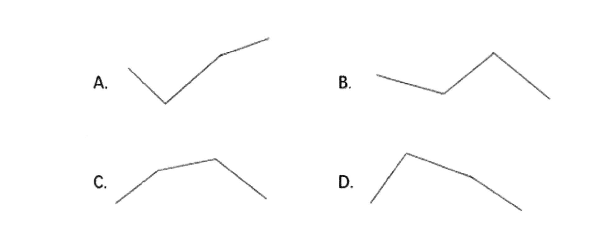

---
tags:
  - 资料
  - 分数比较大小
  - 公务员考试
---

## Card
<!-- hyz-card-id: 01a111cc-7f93-7353-b1dd-d0a8a6c860cc -->

### Front

- 部分比部分越大，部分比整体也越大; 部分比整体越大, 部分比部分也越大; $\frac{A}{B}$, $\frac{A}{B + A}$,如`2021年7月第一产业用电量低于2021年上半年第一产业平均用电量`，$\frac{7月}{1-6月 + 7月}$
- 分式大小分析方法
    - 放缩直接估算两个  
    - 放缩估算一个，用算出来的与另一个分母相乘进行比较  
    - 与固定基准线比较0.5，1这些
    - 线段混合法：$\frac{a}{b}, \frac{A}{B}, \frac{A- a}{B - b}$, 把分子想象成溶质，分母想象成溶液
    - 平均数增长率：$\frac{a * (1 + r_a)}{b * (1 + r_b)} = \frac{A}{B}$,比较$\frac{1 + r_a}{1 + r_b}$

### Back

--

## Card
<!-- hyz-card-id: 01a115a4-bbb7-7950-847d-aea747619fe9 -->

### Front

### Back

也是比较大小，增速比较大小，找最大的是哪个就能确定答案

--

---
