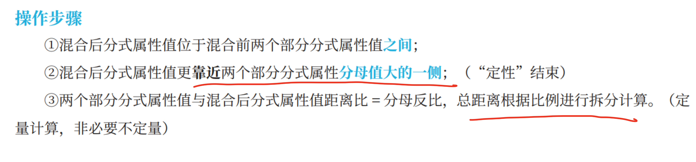

---
tags:
  - 资料
  - 线段混合
  - 公务员考试
---

## Card
<!-- hyz-card-id: 01a11175-1f21-72ef-aa2f-fb6149ef7208 -->

### Front

- **线段混合（加权平均）**
- 总量关系：$A=B+C$
- 属性混合关系：$Ar_a=Br_b+Cr_c$
- 比例公式：$\dfrac{C}{B}=\dfrac{r_b-r_a}{r_a-r_c}$

### Back

设总量 $A$ 由两部分 $B、C$ 组成：

$$
A=B+C.
$$

其中 $r_a、r_b、r_c$ 是对应的属性或增长率。

- 当 $r$ 表示平均身高、平均体重、浓度等属性时，$A、B、C$ 是对应的权重。
- 当 $r$ 表示增长率时，$A、B、C$ 应取同一基期的量。

## 1. 基本公式

加权平均关系为

$$
\boxed{
Ar_a=Br_b+Cr_c
}
$$

代入 $A=B+C$：

$$
\begin{aligned}
(B+C)r_a
&=Br_b+Cr_c \\
Br_a+Cr_a
&=Br_b+Cr_c.
\end{aligned}
$$

## 2. 求两部分的比例

移项并整理：

$$
\begin{aligned}
Cr_a-Cr_c
&=Br_b-Br_a \\
C(r_a-r_c)
&=B(r_b-r_a).
\end{aligned}
$$

当 $r_a\ne r_c$ 时，

$$
\boxed{
\frac{C}{B}
=\frac{r_b-r_a}{r_a-r_c}
=\frac{r_a-r_b}{r_c-r_a}
}
$$

对应的线段关系为

$$
\boxed{
C:B=(r_b-r_a):(r_a-r_c)
}
$$

## 3. 合理性判断

当 $B、C>0$ 时，混合属性 $r_a$ 必须位于 $r_b$ 与 $r_c$ 之间：

$$
\min(r_b,r_c)\le r_a\le\max(r_b,r_c).
$$

若 $r_b=r_c$，则 $r_a=r_b=r_c$，仅凭属性值无法确定 $C:B$。

---

## Card
<!-- hyz-card-id: 01a11175-1f21-72ef-aa2f-fb62f5fa6935 -->

### Front

- **混合定性**：比较 $r_a$ 与 $\dfrac{r_b+r_c}{2}$，判断两部分权重大小。更靠近基期大的那边
- **混合定量**：利用基期比(增速相近$\frac{1+r_b}{1+r_c}$现期近似基期比)与已知增长率换算缺失增长率，或用增速比，平均数或属性比算基期比，部分数比或权重比

### Back

--
